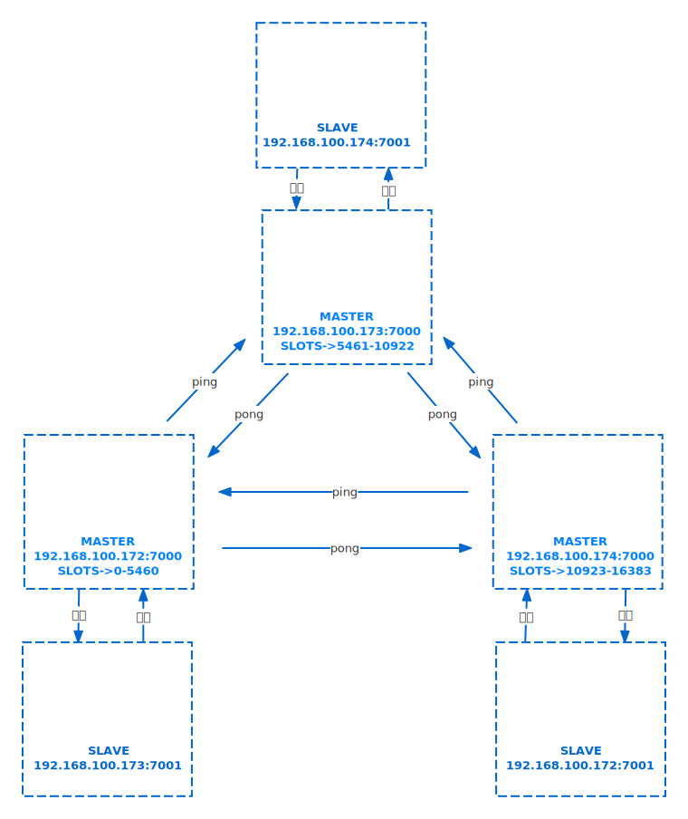

## **介绍**

哨兵（sentinel），是一个分布式系统，用于对主从结构中的每一台服务器进行监控，当master节点出现故障后通过投票机制来挑选新的master节点 ，并且讲所有的salve节点连接到master节点上。

redis哨兵（sentinel）是运行在特殊模式下的redis服务器，不支持读写操作，它的作用是配合redis的复制功能，实现对主从节点的监控，对下线的master节点进行故障转移和通知，确保整个redis系统的可用性。具备几个能力：

- 监控：持续监控master、slave是否处于预期工作状态
- 自动切换主库：当master节点运行故障，哨兵启动自动故障恢复流程：从slave中选择一台作为新的master
- 通知：让slave执行replicaof，和新的master同步，并且通知客户端和新master建立连接

## **架构**

## 哨兵

### **监控**

sentinel定期(1s)向master、slave和其他sentinel发送ping命令，回复有两种情况：

- 有效回复：返回+PONG、
- 无效回复：有效回复之外的回复，或者指定啥时间内返回任何回复

sentinel对探测结果的处理

- slave没有在规定时间响应sentinel的ping命令，sentinel就认为slave节点嗝屁了，就会将他记录为【下线状态】
- master没有在规定时间内响应sentinel的ping命令，sentinel就判定master下线，开始执行【自动切换master】的流程

为了防止master节点假死，sentinel设计了【主观下线】和【客观下线】两个状态。

#### **主观下线**

#### **客观下线**