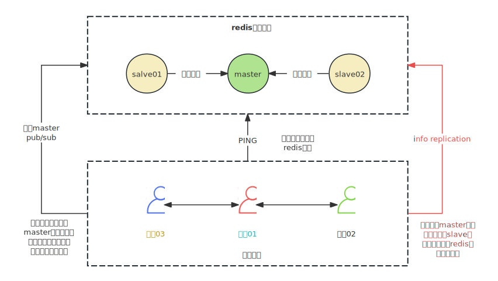

## **介绍**

哨兵（sentinel），是一个分布式系统，用于对主从结构中的每一台服务器进行监控，当master节点出现故障后通过投票机制来挑选新的master节点 ，并且讲所有的salve节点连接到master节点上。

redis哨兵（sentinel）是运行在特殊模式下的redis服务器，不支持读写操作，它的作用是配合redis的复制功能，实现对主从节点的监控，对下线的master节点进行故障转移和通知，确保整个redis系统的可用性。具备几个能力：

- **监控**：持续监控master、slave是否处于预期工作状态
- **自动切换主库**：当master节点运行故障，哨兵启动自动故障恢复流程：从slave中选择一台作为新的master
- **通知**：让slave节点执行replicaof，和新的master同步，并且通知客户端和新master建立连接

## **架构**



## 哨兵原理

#### 从库发现

*哨兵升级如何发现其他redis节点的?*

哨兵配置文件中设置了需要监控redis集群，当哨兵运行时，会和redis master节点建立连接，调用`info replication`命令获取所有slave节点的信息，从而和所有 salve节点建立连接

哨兵节点每10s会发送一次`info replication`命令，获取redis集群实时主从节点信息，如果有新的节点加入到主从集群，哨兵会自动连接并监控新节点

#### pub/sub机制

*哨兵集群是如何发现其他哨兵节点的？*

哨兵会在每个redis节点上建立和订阅一个特殊的频道：__sentinel__::hello，哨兵通过它发布消息，其他哨兵订阅消息，来发现彼此的存在，实现互相通讯

哨兵节点每2s会向频道发布一条消息（包含哨兵自身的基础信息），这样哨兵就能知道其他哨兵的状态，监控的主节点以及是否有新哨兵加入

#### **监控**

sentinel知道所有redis节点之后，会定期(1s)向master、slave和其他sentinel发送`ping`命令，以此来判断redis节点是否正常，回复有两种情况：

```
- 有效回复：返回+PONG、+LOADING、-MASTERDOWN
- 无效回复：有效回复之外的回复，或者指定啥时间内(down-after-millisenconds)没有返回任何响应
```

slave节点没有在规定时间响应sentinel的ping命令，sentinel就认为slave节点挂了，就会将他记录为【下线状态】，而

master节点没有在规定时间内响应sentinel的ping命令，sentinel就判定master下线，但是单台哨兵不能判断master真的下线，为了防止master节点假死，sentinel设计了【主观下线】和【客观下线】两个状态

##### **主观下线**

哨兵对节点进行探测，没有得到有效回复的时候，就会对节点标记<u>sdown</u>状态【主观下线】

如果是slave节点，对集群没有影响，不会进行下一步动作

如果是master节点，哨兵会确认master节点是否真的下线，并执行故障转移

##### **客观下线**

哨兵确认master节点是否真的宕机，需要进行投票，所有哨兵达成共识（哨兵投票，如果票数大于一半，且大于等于`quorum`设置的数量，就是投票成功）认为master节点【主观下线】了，哨兵才能确认master节点【客观下线】，执行<u>odown</u>

```
# sentinel.conf
sentinel monitor <master-name> <ip> <redis-port> <quorum>

# sentinel monitor：标识哨兵要监控哪个master节点
# master-name：redis的名称，自定义
# ip：redis master节点ip
# redis-port：redis master节点端口
# quorum：法定数量，代表>=N个哨兵认为主节点不可用的时候，才会把master节点设置为客观下线状态
```

##### **客观下线投票过程**


*如果多个哨兵在同一时间内发现master节点主观下线，那么每个发现的哨兵都会发起投票，投票的结果真是让发起投票的哨兵能够确认master节点是否下线，并不会与其他哨兵共享。因此这个下线确认的动作可能是多个哨兵同时发起进行的。*

##### **主观下线和客观下线的区别**

主观下线是哨兵认为节点宕机了，而客观下线是不但哨兵认为节点宕机了，而且该哨兵和其他哨兵达成了共识，一致认为节点宕机了。

